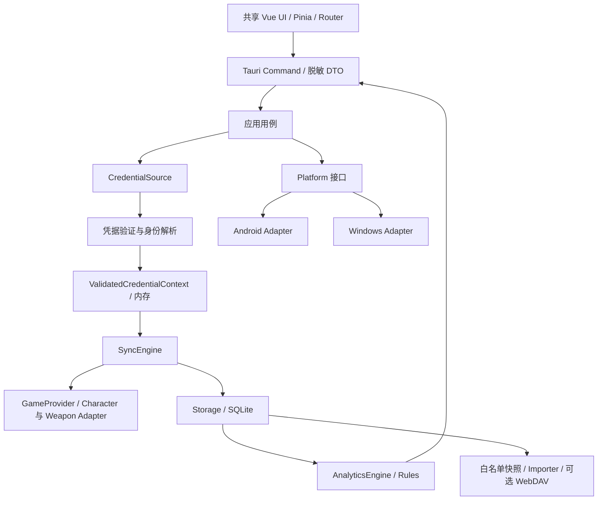

# 架构与模块边界

状态：整体仍为目标设计，已实现 Nuxt/Tauri 最小官方页面打开入口与无凭据观察表；共享授权/取数/存储核心尚未实现。平台顺序和功能范围见 [PROJECT_CONTEXT](PROJECT_CONTEXT.md)。

## 数据流



网络和授权由核心与平台层负责。普通 Vue store 只保存角色选择、脱敏状态和结果，不能承载长期 Token。Rust 拥有业务持久化与授权用例；UI 只获取需要展示的 DTO。

## 推荐目录

以下是完整产品的后续目录草案；当前只创建实际使用的原型目录，不创建空业务模块。续轮选定沿用 bhaoo Nuxt 静态前端，保留上游 app/ 约定，不为改目录重写成熟逻辑；实际源码引入尚未执行。

```text
app/                         # 保留主基线 Nuxt 约定
  pages/ components/ stores/
  services/ipc/              # 受限 commands 与 DTO
  types/                    # 从契约生成/校验，避免 Rust/TS 漂移
src-tauri/src/
  commands/                 # 参数校验、用例调用、脱敏事件
  core/
    domain/                 # 身份、记录、规则、错误类型
    credentials/            # URL parser、手动授权、网页登录接口
    providers/
      hypergryph_cn/        # 官服/B服差异封装在内
      gryphline_global/     # 预留，不扩大 V0.1 范围
    sync/                   # character、weapon、分页、去重、恢复
    analytics/ rules/
    importers/              # 纯转换，外部格式到统一记录
  storage/ migrations/
  platform/                 # android、windows、secure_store、file、callback
  webdav/                   # V0.5，业务快照同步
tests/fixtures/             # 合成或充分脱敏样本
docs/reference/             # 固定版本证据和复用评估
```

先使用一个 Rust 工程内模块边界，不为了目录漂亮拆大量 crate；未来真正存在复用需求再拆包。移植纯 TS 时保留一个权威实现，不同时重写等价 Rust 版本。

## CredentialSource 与 Provider

CredentialSource 候选：GachaUrlCredentialSource、ManualTokenCredentialSource、WebLoginCredentialSource、ImportedCredentialSource、FutureCredentialSource。ImportedCredentialSource 仅指用户主动提供的本地授权输入，不表示从 WebDAV 或历史记录文件导入游戏授权。

未验证输入产生 CredentialCandidate，包含候选 provider/region/channel/server、可能的 gameUid/roleId、秘密 Token、tokenType、source、可未知的 expiresAt。解析成功不代表授权有效。

验证后产生只在核心内存在的 ValidatedCredentialContext，携带凭据引用、验证范围/时间和身份状态。UI 只拿到不含秘密的 CredentialSummary。SyncEngine 不判断 Token 来自 URL、登录还是手动输入；只消费已验证的上下文和目标数据流。

身份解析是单独门槛：授权能访问 API，不等于已知确切角色。不能识别稳定身份时进入未归属暂存，不能写入正式角色历史或与已有数据合并。

GameProvider 提供 authenticate / validateCredential / refreshCredential / listGameAccounts / listRoles / syncCharacterGacha / listWeaponPools / syncWeaponGacha / logout。不是每种凭据都支持全部能力，以 capability 和明确错误表达；不可假装 URL 短 Token 能刷新或列出所有账号。

Character 与 Weapon 各有 DTO 校验及分页策略；武器先列卡池的能力保留。SyncEngine 拥有调度、重试、事务和检查点，Provider 负责协议转换，不能让两层各自维护一套分页状态。

## Domain 与统计

核心概念：Account、GameAccount、GameRole、Credential、GachaRecord、GachaPool、PoolRule、SyncState、Metadata、AppSettings。内部 UUID 与外部身份严格分离，持久化见 [DATABASE](DATABASE.md)。

AnalyticsEngine 输入 GachaRecord[]、版本化 PoolRule[] 和覆盖范围，输出 AnalyticsSnapshot。Vue computed 仅组织展示；不能成为唯一统计实现。角色池、武器池、免费抽、UP 判定与跨池继承分别定义；规则未知时返回 unavailable / lower_bound / partial，不能以 0 代替未知。

PoolRule 包含 poolType、hardPity、guaranteeRule、specialGuarantee、carryPolicy、effectiveFrom/To、version、来源和验证状态。原要求中的 80 / 120 / 240 只是需核验的示例数字，本仓库不视为真实规则。

## 平台与错误

Android/Windows 仅适配 WebView、系统浏览器回调、Deep Link、安全存储、文件权限、分享和生命周期。业务层不依赖 Android Activity 或 Windows 文件路径。PWA 后续通过轻量存储适配器读取无凭据数据，不暴露原生权限。

统一错误区分输入错误、授权无效/过期、身份不明、离线、限流、超时、协议变化、分页循环、部分成功、数据库失败和取消。UI 用可操作中文提示；完整 URL、Header、响应体不能进入错误事件。
