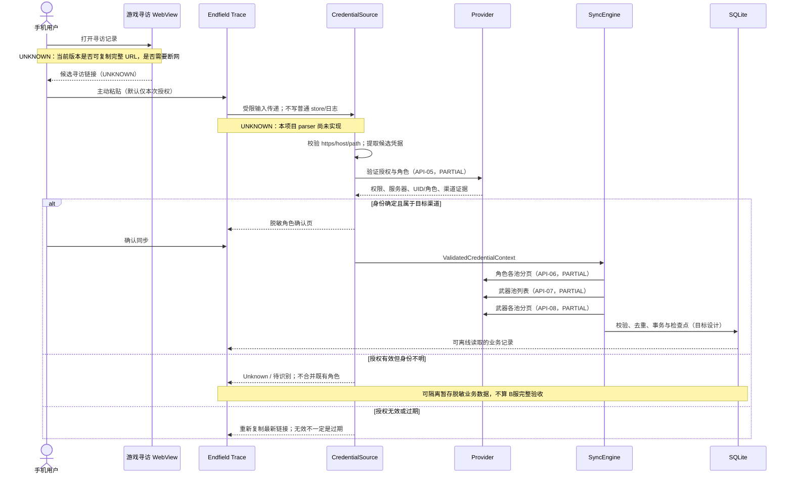
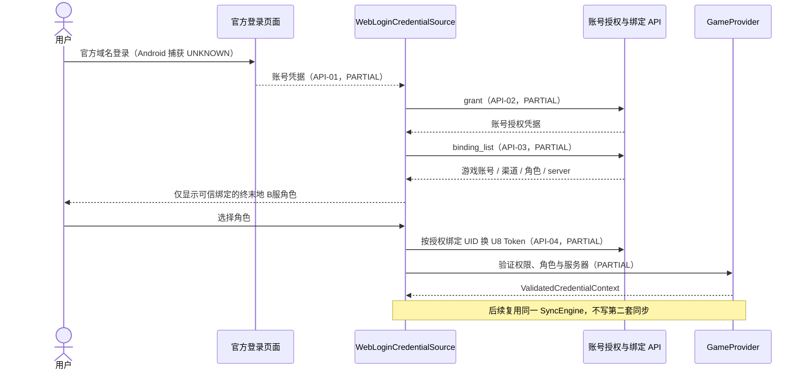

# Bilibili 授权与数据归属

状态：源码线索 PARTIAL，Android 完整链 UNKNOWN；无实机 VERIFIED 节点。状态解释以 [API_RESEARCH](API_RESEARCH.md) 为准。

## 第一优先级：URL 授权

图中架构步骤为计划而非运行证据。具体 URL 获取矩阵见 [GACHA_URL_RESEARCH](GACHA_URL_RESEARCH.md)。

## 后备路线：官方网页登录与绑定

主基线 README 提示 B服先在鹰角用户中心绑定；这是上游使用前提说明，本项目需验证当前账号/版本是否适用，不能默认为每个用户已绑定。

## 身份规则与节点清单

| 节点 | 状态 | 缺失证据 |
| --- | --- | --- |
| Android 游戏 URL 获取 | UNKNOWN | 游戏版本、官服/B服真机复现 |
| URL parser 与输入格式 | PARTIAL（上游线索） | parser 实现审计、移动样本、异常测试 |
| grant → binding → U8 | PARTIAL | 真实 B服授权与错误样本 |
| role/server 解析 | PARTIAL | 凭据作用域、歧义和多角色验证 |
| 渠道字段映射 | PARTIAL | 当前返回值及稳定性；类型声明不够 |
| Character / Weapon 分页 | PARTIAL | 同一授权可用性、唯一性和顺序 |
| Android 完整落库与重启 | UNKNOWN | APK/SQLite/设备实测 |
| HGWebview.log 路线 | DEPRECATED（作为本项目核心路径） | 上游曾报告日志显示变化；不据此认定所有历史版本均失效 |

内部 UUID 不来自昵称或 UID 截断。外部身份包含 provider、region、channel、gameUid、externalRoleId、serverId，未知值不伪填。URL 输入的身份声明不能替代可信 API 验证；不采用首个角色回退、不用昵称匹配，也不拉其他用户数据再过滤。

账号登录不是 URL 路线前置条件：没有账号级登录时 Account 可缺省，已验证的 GameAccount/GameRole 可以独立存在；细节见 [DATABASE](DATABASE.md)。
